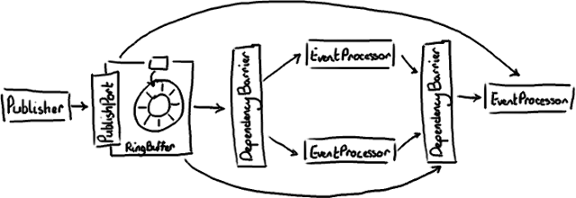

# Disruptor 2.0更新摘要

马丁最近发布了Disruptor的2.0版本，从我们开始将其开源以来发生了很多变化，现在是个时候推出一个正式的里程碑了。马丁的博客上涵盖了这次更新的所有内容，这篇文章的目的是尝试把我以前的博文以新框架的架构转述给大家，因为将它们都重写一遍要耗费很多时间。现在我看到手工绘图的缺点了。


在旧的版本中：

.png)

这是一个Disruptor的配置示例，具体上来说就是一个菱形的结构。如果你对此毫无感觉，可以回过头复习下disruptor的细节。

对于2.0版的主要变化有3点：

1. 更贴切的命名；
2. 把producer barrier（生产者屏障）整合进了ring buffer；
3. 将Disruptor Wizard加入了主代码库。


新版本：



你可以看到基本原理还是类似的。新版本更加简单，因为ProducerBarrier本身不再作为一个单独的实体存在，它的替代者是PublishPort 接口，且RingBuffer自身就实现了这个接口。 类似地，DependencyBarrier替代ConsumerBarrier ，厘清了此对象的职责。另外，Publisher (Producer的替代者)和EventProcessor(替代了Consumer)也更能精确地体现出它们的行为。Consumer这个名字总是会带来一些混淆，因为因为其实消费者从来不从ring buffer消费任何东西。Consumer之前仅仅是用于队列实现的一个术语。

图上没有表现出来的变动是以前存在ring buffer里的东西叫entry(输入条目），而现在改名叫Event（事件）了，相应的就是EventProcessor。

整个命名上的大规模更改是为了让大家更清晰的明白Disruptor是如何工作的，以及该如何使用它。尽管我们把它用在事件处理上，但是当我们开源它的时候，还是希望它看起来可以更像一个通用的解决方案，所以命名惯例也倾向于表述这个事实。但是事件模型看起来确实更直观一些，于是我们就改成这个命名了。

另外由于Wizard的引入，事件发布者和事件处理者之间的接驳更加简单了。

现在如果你想建立一个菱形的Disruptor模式（例如FizzBuzz性能测试），一切变得优雅很多：

```
DisruptorWizard dw = new DisruptorWizard(
                         ENTRY_FACTORY,
                         RING_BUFFER_SIZE,
                         EXECUTOR,
                         ClaimStrategy.Option.SINGLE_THREADED,
                         WaitStrategy.Option.YIELDING);
FizzBuzzEventHandler fizzHandler =
                         new FizzBuzzEventHandler(FIZZ);
FizzBuzzEventHandler buzzHandler =
                         new FizzBuzzEventHandler(BUZZ);
FizzBuzzEventHandler fizzBuzzHandler =
                         new FizzBuzzEventHandler(FIZZ_BUZZ);

dw.handleEventsWith(fizzHandler, buzzHandler)
  .then(fizzBuzzHandler);

RingBuffer ringBuffer = dw.start();
```

[Wizard Wiki 传送门](http://code.google.com/p/disruptor/wiki/DisruptorWizard)

### 其它变化：性能提升

马丁在他博客提到过，他已经成功的提高了2.0版的性能。 在2.0版中还有一个闪耀的新成员Sequence（序列），它被用来搞缓存行填充，并消除了对内存屏障的需要。现在缓存行填充的做法和以前略有不同，因为JAVA7新的优化特性，它成功的“优化”掉了我们原来的技术方案。

那么就到这里吧，这篇博文我就是想给大家一个简明的更新摘要，并且解释我以前画的图为什么可能不再正确了。