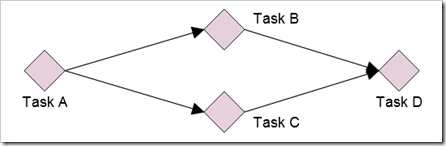
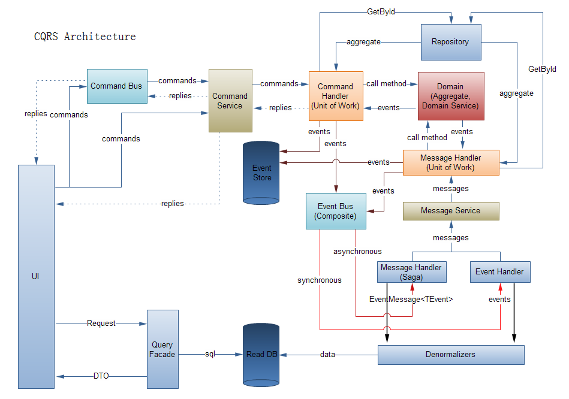

# 通过Axon和Disruptor处理1M tps

LMAX，一家在英国的金融公司，最近开源了其（新型零售金融交易平台的）核心组件之一：Disruptor。这个组件通过删除必须的锁来降低执行开销，且任然保证正确的处理订单。如果你问我，我会说这是一个优美精巧的工程。我尝试把Disruptor应用到Axon控制总线中，就是想看看它到底有多大的潜力。结果相当惊人。

## The Disruptor
Disruptor是一个并发编程框架，它允许开发者使用多线程技术去创建基于任务的工作流。Disruptor能用来并行创建任务，同时保证多个处理过程的有序性。它删除了保证处理有序性所需要的队列。它拥有几个技术上的特征，可以明确把它和其他并发编程框架区分开来，这些并发技术从java 5开始为程序员可用。主要的一个是没有使用锁机制。

考虑处理完成一个大任务，需要从A到D的4个步骤（4个子任务）。如果任务B和C都要依赖于任务A的执行结果，但B和C不依赖任何其他任务，它们可能被并行化执行。在这个例子中，任务D依赖任务B和C的执行结果。

如果在java5中要创建一个这样的流式处理机制，需要使用诸如队列这样的技术。这会使任务的处理变的复杂；更重要的是，处理过程会比较慢。因为在向队列put或poll元素时，线程需要获取锁。

Disruptor使用其他途径来执行这些任务序列。它的主要组件是RingBuffer。RingBuffer实现了一个环形缓冲器，这个RingBuffer能控制任务的执行。不同的任务读/写包含在缓冲器中的元素；一个任务的读和写，独立于其他任务的读和写。这通常是令人满意的。有时候你需要去确认，在任务B 和C完成它们的工作之前，任务D有没有开始执行。

环形缓冲器上面的不同“消费者”，时刻观察它们依赖的消费者的执行进展。这个功能是通过跟踪其他消费者已经处理完成的任务的序列号来实现的。这允许Disruptor最小化“内部消费者（inter-consumer）”的通信总量。举一个例子，假设消费者D刚刚处理完了标号为8的任务，它将需要知道是否允许处理9。它将询问消费者B和C：“你们在哪里”？B和C回答：“23”和“12”。在这种情况下，消费者D能明白它可以安全的处理9,10和11。在这个期间，消费者D不需要询问B和C的进展情况。消费者D处理完11之后，它将需要再次询问消费者B 和C。

减少“内部线程（inter-thread）”的通信总量，可以让CPU优化对缓存的使用。LMAX开发团队称这个机制为感应（Sympathy）。为了取得最好的结果，代码已经根据CPU的工作机制做了优化。

我没有试图去解释disruptor在技术上的所有来龙去脉，Trisha已经完成了一个系列的文章，这里还有一篇技术论文。

## Axon控制总线的基准测试
Disruptor模式适合在基于CQRS（命令查询责任分类，Command Query Responsibility Segregation)架构的基础上来处理命令。当某个进程“预加载（pre-load）”一个聚合对象群（aggregate）时，其他进程将执行命令处理器（command handler），之后其它的存储事件（store events）进入事件存储（event store）中，且在事件总线（event bus）上发布这个存储事件。我想尝试一下，看能得到什么样的结果。

使用disruptor来实现一个概念验证风格（proof-of-concept style）的命令总线，是非常容易的事情。disruptor的jar文件中有一个helper类，它可以帮助你优化处理速度（有些显而易见的事情，比如通过缓存行的填充来避免假共享）。

我的基准应用包含一个简单的配置：一个命令处理器加载一个聚合对象群（在基准应用中只使用了1个聚合对象）。并在聚合对象上执行“doSomething”的方法。这个方法生成一个单一事件，这个事件需要存储到在内存中（in-memory）的事件存储中，而且这个事件被发布到一个事件总线中（没有监听器监听到这个事件）。这个基准应用的目标是关注“单纯的命令处理”的速度。

我在笔记本电脑上运行了这个基准应用，这个笔记本的配置是：英特尔酷睿i7640M处理器（2.8 GHz，双核，4线程）。

当使用SimpleCommandBus和CachingGenericEventSourcingRepository时，在我的电脑上得到了大约每秒处理150 000个命令的成绩。这个成绩很可能远远超过了大多数应用程序可以取得的成绩（吹牛吹出来的成绩不算:)）。

然后，我使用disruptor创建了一个基于命令总线的简单应用。这个应用在一秒中执行了大约250 000个命令。这个应用差不多比上面的基准应用快了一倍。但结果还是让我失望。这里必然有某种方法来提高命令的执行速度。

于是，我开始稍作调整。Axon使用java.util.UUID来获得唯一事件标识符，我想彻底删除它（别担心，这只是为了测试）。你猜怎么了，我取得了大约每秒处理700 000个命令的成绩。现在取得了一些进展，但没有标识符的应用是一个不真实的应用（应用使用的是随机UUID）。

接下来，我改变UUID生成机制为一个基于时间的版本，得到的成绩倒退到50K，但现在至少我有了我自己的标识符。

这时候，我发现我是在一个32位的JVM上运行应用。当我把同样的基准程序在64位的JVM上运行时，执行结果几乎翻了一番。这听起来合乎逻辑，但Oracle说迁移到64位JVM将降低性能。通过基于时间的UUID和其它的小优化，我取得了每秒处理1.3M （1 300 000）个命令的成绩。这个成绩比同样的情况下使用锁的机制取得的成绩，高50多倍。

译注–CQRS架构图如下，供读者参考：

## 总结
看起来，在同样的硬件上处理同样的逻辑，disruptor比基于锁的实现机制更快。使用disruptor来编写好的应用，需要一些编程的惯用法则。但一旦生产者，消费者和它们之间的依赖关系被确定，开始运行将非常简单。